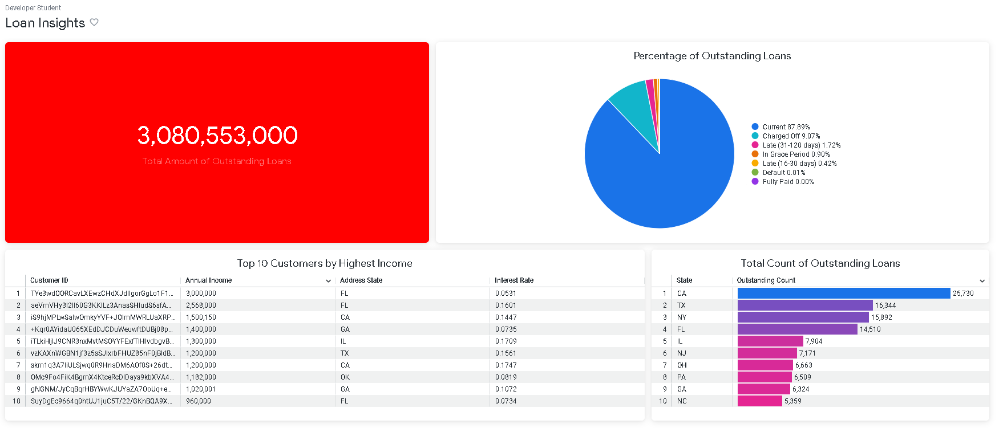
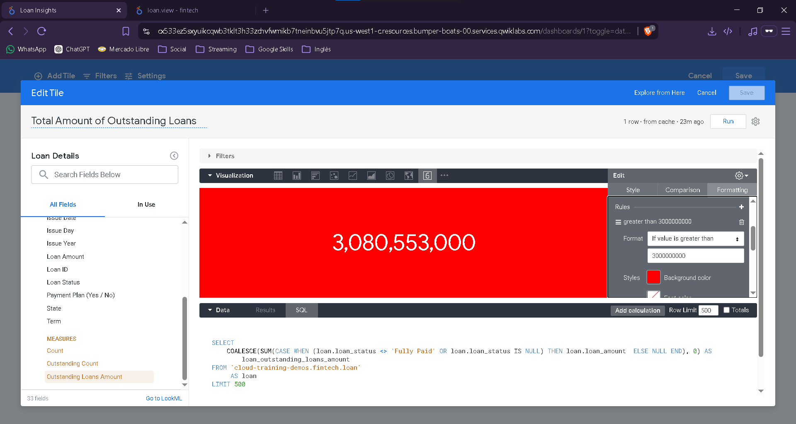
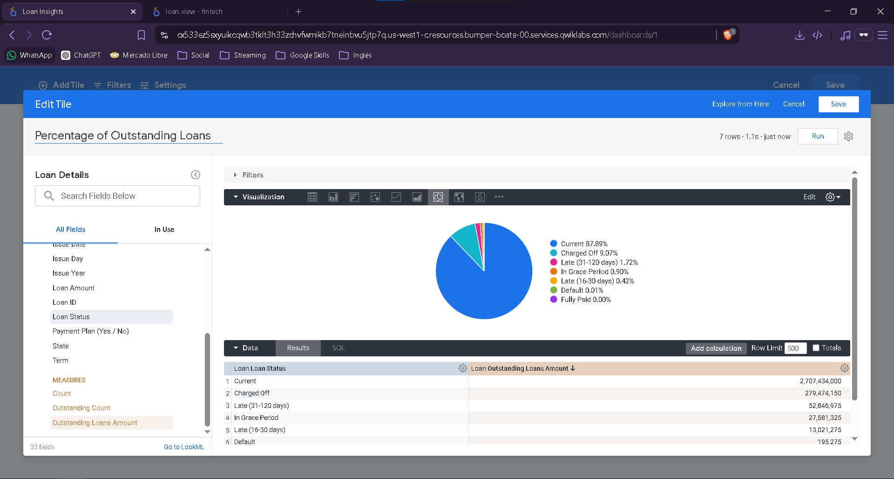
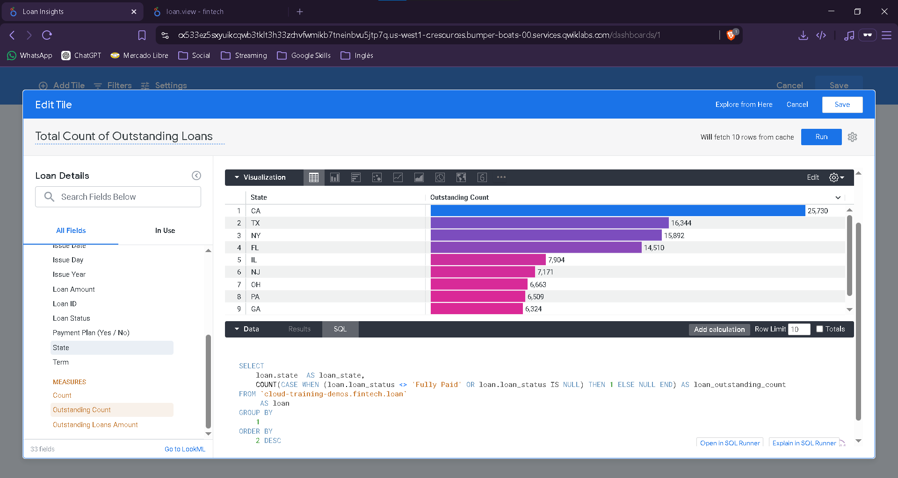
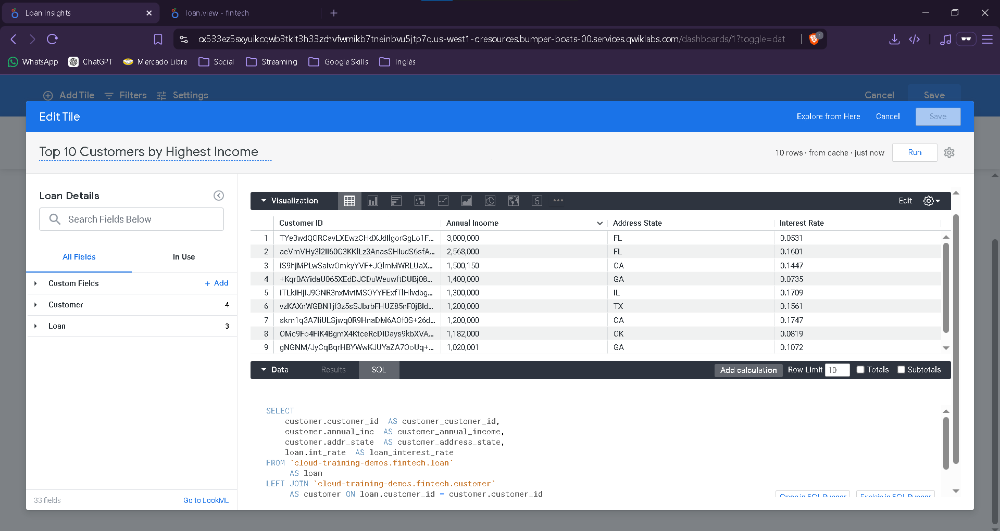

# TheLook Fintech Loan Analysis
Created by [Karla Roman](https://github.com/karla-roman)


Data analysis project developed using **Google BigQuery**, **SQL**, and **Looker Enterprise** to support business decisions for a fintech lending company.

---

## Project Overview

The Treasury team at TheLook Fintech needed better visibility into their loan portfolio to monitor cash flow, understand borrower behavior, and evaluate lending risk.

The goal of this project was to collect, transform, and analyze loan data, then create business-ready reports and dashboards that support daily decision-making.



---

## Business Questions

This project focuses on four key business questions:

* How can loan cash flow be monitored over time?
* What are the most common reasons customers request loans?
* How are loans distributed across geographic regions?
* What is the current health of the outstanding loan portfolio?

---

## Data Sources

The analysis combines loan and customer information stored in BigQuery with an external regional classification dataset used to enrich geographic reporting.

Main data domains:

* Loan information
* Customer information
* Loan status
* Geographic location
* Loan purpose
* Financial metrics

---

## Solution Architecture

```text
Raw Loan Data
       │
       ▼
Google BigQuery
       │
       ├── Data Cleaning
       ├── Data Enrichment
       ├── Aggregations
       └── Reporting Tables
       │
       ▼
Looker Enterprise
       │
       ▼
Business Dashboard
```

---

## Data Processing

| File                                                               | Description                         |
| ------------------------------------------------------------------ | ----------------------------------- |
| [create_state_region_table.sql](sql/create_state_region_table.sql) | Import regional classification data |
| [loan_region_report.sql](sql/loan_region_report.sql)               | Join loan and regional data         |
| [loan_purposes.sql](sql/loan_purposes.sql)                         | Create distinct loan purposes       |
| [loan_count_by_year.sql](sql/loan_count_by_year.sql)               | Count loans by year                 |

---

## Dashboard

A Looker Enterprise dashboard was developed to provide quick access to key portfolio metrics.

### Total Outstanding Loan Balance

Tracks the total value of active loans and helps monitor overall exposure.



---

### Outstanding Loans by Status

Displays the distribution of loans across different status categories.

Examples:

* Current
* Late
* Default
* Charged Off
* Fully Paid



---

### Top 10 States by Outstanding Loans

Highlights geographic concentrations of lending activity.



---

### Top 10 Customers by Highest Income

Identifies high-income borrowers who own their homes outright and currently maintain active loans.



---

## Technologies Used

| Technology            | Purpose                           |
| --------------------- | --------------------------------- |
| Google BigQuery       | Data warehouse                    |
| SQL                   | Data transformation and reporting |
| Looker Enterprise     | Dashboard development             |
| Connected Sheets      | Business reporting                |
| Google Cloud Platform | Cloud environment                 |

---

## Skills Demonstrated

* SQL Development
* Data Cleaning
* Data Transformation
* Data Modeling
* Data Aggregation
* Business Intelligence
* Dashboard Design
* Data Visualization
* BigQuery
* Looker Enterprise
* Cloud Analytics

---

## Repository Structure

```text
thelook-fintech-loan-analysis
│
├── README.md
│
├── sql
│   ├── create_state_region_table.sql
│   ├── loan_count_by_year.sql
│   ├── loan_purposes.sql
│   └── loan_region_report.sql
│
└── images
    ├── dashboard_overview.png
    ├── outstanding_loans.png
    ├── loan_status_distribution.png
    ├── top_states.png
    └── top_customers.png
```

---

## Key Outcome

This project transformed raw loan data into actionable business insights through SQL-based data preparation and interactive dashboards. The resulting reports help stakeholders monitor portfolio performance, understand borrower behavior, and evaluate lending risk across regions.
